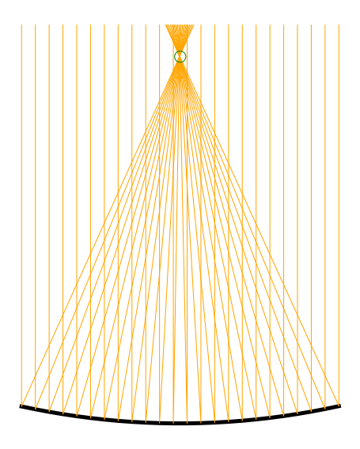

# Geometry-informed Neural Networks (GINNs)

This project accompanies the paper "Geometry-informed Neural Networks", which does objective-based generation without examples.

### **[Project Page TODO]() | [arXiv](https://arxiv.org/abs/2402.14009)


## High level description

```
/
├── run.py                          # Entry point for the program
├── train/                          # Functionality for training
│   └── ginn_trainer.ipynb          # Handles the training loop of the network
├── configs/                        # Contains YML files to configure
├── GINN/                           # folder for GINN training
│   ├── data/                       # Dataloader for a setting of GINNs with data
│   ├── evaluation/                 # Code to compute metrics of generated 2D and 3D shapes
│   ├── ph/                         # Classes to manage the connectedness loss based on persistent homology
│   ├── plot/                       # Plotters for 2D and 3D
│   ├── problems/                   # Contains general geometric primitives
│   ├── simJEB/                     # Contains files to load the simjeb envelope and interface
│   ├── speed/                      # Contains classes useful for multiprocessing or measuring time
├── models/                         # Model definitions for different architectures
├── util/                           # Utilities used throughout the project
```

## How to get started?

### Minimum Surface

Plateau’s problem is to find the surface $S$ with the minimal area given a prescribed boundary $\Gamma$ (a closed curve in $X \in \mathbb{R}$).
A minimal surface is known to have zero mean curvature $\kappa_H$ everywhere.

With [notebooks/min_surf.ipynb](notebooks/min_surf.ipynb) you can train a neural network to learn a shape with minimal surface. It just takes a few seconds to converge.


### Parabolic Mirror

The task for the neural network is to learn the height function $f: [−1, 1] \mapsto \mathbb{R}$ of a mirror with the
interface constraint $f(0) = 0$ and that all the reflected rays should intersect at the single point $(0, 1)$.
The following figure shows the known solution: a parabolic mirror.




### Jet engine bracket

The problem specification for the jet engine bracked (JEB) draws inspiration from an engineering design competition hosted by General Electric and GrabCAD ([paper](https://arxiv.org/abs/2105.03534v1), [website](https://simjeb.github.io/)). The challenge was to design the lightest possible  lifting bracket for a jet engine subject to both physical and geometrical constraints. Here, we focus only on the geometric constraints: the shape must fit in a provided design space $E$ and attach to six cylindrical interfaces $I$. In addition, we posit connectedness as a trivial requirement for structural integrity.

You can finetune a jet engine bracked using the notebook [_quickstart_3d.ipynb](_quickstart_3d.ipynb). It does only a few training iterations as training a single neural network to produce a shape from scratch takes around 15 hours on a Titan V GPU (12 GB RAM).


## Reproduce the results for the obstacle or JEB

Install the necessary dependencies

    pip install -r requirements.txt

You can start training by specifying a config from the 'configs' folder.

    python run.py gpu_list=0 yml=simjeb_wire_singleshape
