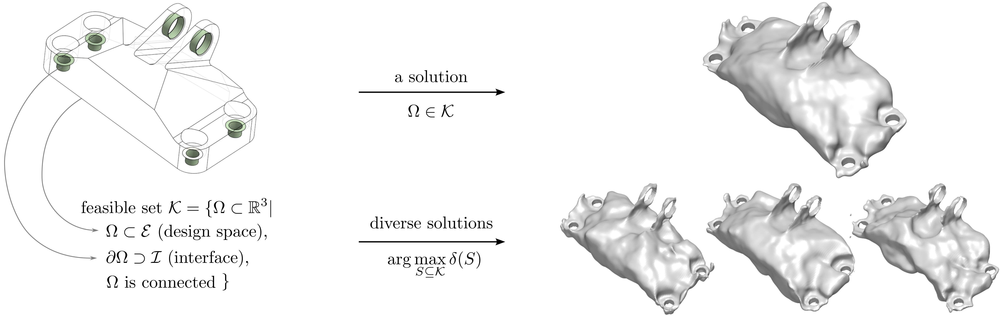
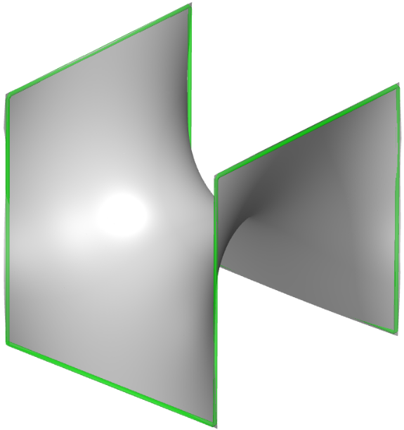
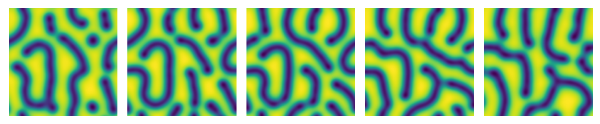
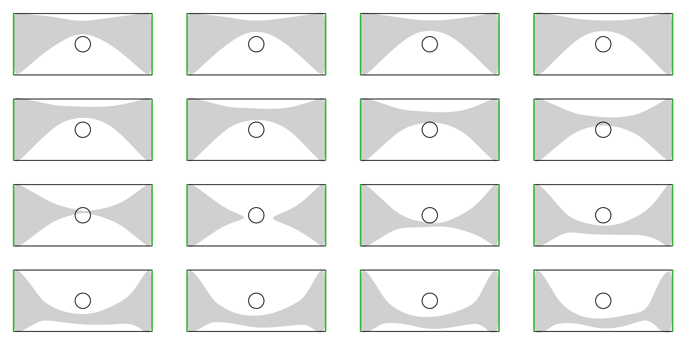

# Geometry-Informed Neural Networks (GINNs)

This project accompanies the paper "Geometry-informed Neural Networks", which does objective-based generation without examples.

### [Project page](https://arturs-berzins.github.io/GINN) | [arXiv](https://arxiv.org/abs/2402.14009)



## High-level description

```
/
├── _quickstart                     # Entry point for the program
├── run.py                          # Entry point for the program
├── train/                          # Functionality for training
│   └── ginn_trainer.ip             # Defines the GINN training process
├── configs/                        # YML configurations
├── GINN/                           # Folder for GINN training
│   ├── geometry/                   # General geometric primitives
│   ├── helpers/                    # Helpers useful for training, e.g. measuring time
│   ├── morse/                      # Collection of classes to manage the connectedness loss based on Morse theory
│   ├── visualize/                  # Plotters for 2D and 3D
│   ├── simJEB/                     # Meshes defining the interface and design region
├── models/                         # Model definitions for different architectures
├── visualization/                  # Global helpers for visualization
└── tests/                          # Contains tests for some classes
└── evaluation/                     # Contains code to compute metrics of generated shapes
```

## How to get started?

### Minimal surface

Plateau’s problem is to find the surface $S$ with the minimal area given a prescribed boundary $\Gamma$ (a closed curve in $X \in \mathbb{R}^3$).
A minimal surface is known to have zero mean curvature $\kappa_H$ everywhere.

With [notebooks/minimal_surface.ipynb](notebooks/minimal_surface.ipynb) you can train a neural network to learn a shape with minimal surface. It just takes a few seconds to converge.




### Gray-scott model of reaction-diffusion
Reaction-diffusion systems were introduced by Alan Turing to explain how patterns
in nature, such as stripes and spots, can form as a result of a simple physical process of reaction and
diffusion of two substances. A celebrated model of such a system is the Gray-Scott model, which
produces a variety of patterns by changing just two parameters – the feed-rate $\alpha$ and the kill-rate $\beta$.

To demonstrate a **generative PINN** on a problem that admits multiple solutions, we omit the initial condition and
instead consider stationary solutions, which are known to exist for some parameters $\alpha$ and $\beta$.
In the follwing Figure, we show the result of searching for diverse solutions to an under-determined Gray-Scott system. 
It is a generative PINN producing Turing patterns that morph during latent space interpolation (interpolations from col. 2 to 4).

For more details, see [our paper](https://arxiv.org/abs/2402.14009), Section 4.3.




### Obstacle

Install the necessary dependencies

    pip install -r requirements.txt

You can start training a shape for the obstacle by specifying the config from the 'configs' folder.

    python run.py --gpu_list 0 --yml obst2d_siren.yml

Training with 16 latent codes from scratch takes around 5 hours on a Titan V GPU (12 GB RAM).
The following Figure shows the shapes of 16 latent codes of a softplus-MLP model trained with explicit diversity.




### Jet engine bracket

The problem specification for the jet engine bracked (JEB) draws inspiration from an engineering design competition hosted by General Electric and GrabCAD ([paper](https://arxiv.org/abs/2105.03534v1), [website](https://simjeb.github.io/)). The challenge was to design the lightest possible  lifting bracket for a jet engine subject to both physical and geometrical constraints. Here, we focus only on the geometric constraints: the shape must fit in a provided design space $E$ and attach to six cylindrical interfaces $I$. In addition, we posit connectedness as a trivial requirement for structural integrity.


You can finetune a jet engine bracket using the notebook [_quickstart_3d.ipynb](_quickstart_3d.ipynb). 
The notebook only performs a few training iterations as training a single neural network to produce a shape from scratch takes around 15 hours on a Titan V GPU (12 GB RAM).
For the jet engine bracket, we recommend to follow these steps:
- First precompute and save points of the jet engine bracket design problem. This can be done by using the code in `/notebooks/mesh_to_samples.ipynb`.
- Then use the `simjeb_cond_siren.yml` config.
