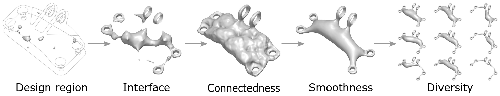

# Geometry-informed Neural Networks (GINNs)

### [Project Page](https://arturs-berzins.github.io/GINN/) | [arXiv](https://arxiv.org/abs/2402.14009)


This project accompanies the paper "Geometry-informed Neural Networks", which allows to train shape generative models without data.
Instead, GINNs are trained to satisfy design requirements given as constraints and objectives.
In particular, a diversity constraint makes these models generative.
GINNs not only learn to generate multiple diverse solutions, but can also learn an organized latent space as shown above.




## Organization

```
/
├── run.py                          # Entry point for the program
├── train/                          # Functionality for training
│   └── ginn_trainer.ipynb          # Handles the training loop of the network
├── configs/                        # Contains YML files to configure
├── GINN/                           # folder for GINN training
│   ├── data/                       # Dataloader for a setting of GINNs with data
│   ├── evaluation/                 # Code to compute metrics of generated 2D and 3D shapes
│   ├── ph/                         # Classes to manage the connectedness loss based on persistent homology
│   ├── plot/                       # Plotters for 2D and 3D
│   ├── problems/                   # Contains general geometric primitives
│   ├── simJEB/                     # Contains files to load the simjeb envelope and interface
│   ├── speed/                      # Contains classes useful for multiprocessing or measuring time
├── models/                         # Model definitions for different architectures
├── util/                           # Utilities used throughout the project
```

## How to get started?

Install the necessary dependencies

```pip install -r requirements.txt```

### Jet engine bracket

The problem specification for the jet engine bracked draws inspiration from an engineering design competition hosted by General Electric and GrabCAD ([paper](https://arxiv.org/abs/2105.03534v1), [website](https://simjeb.github.io/)). The challenge was to design the lightest possible lifting bracket for a jet engine subject to both physical and geometrical constraints. Here, we focus only on the geometric constraints: the shape must fit in a provided design space and attach to six cylindrical interfaces. In addition, we require connectedness as a trivial requirement for structural integrity and a smooth surface.


Start the training by specifying a config from the `configs` folder.

```python run.py gpu_list=0 yml=simjeb_wire_singleshape```


### Minimal surface

Plateau’s problem is to find the surface $S$ with the minimal area given a prescribed boundary $\Gamma$ (a closed curve in $X \in \mathbb{R}$).
A minimal surface is known to have zero mean-curvature $\kappa_H$ everywhere.

With [notebooks/min_surf.ipynb](notebooks/min_surf.ipynb) you can train a GINN to learn the minimal surface. It takes a few seconds to converge. This code does not use the more advanced adaptive augmented Lagrangian method for constrained optimization.

