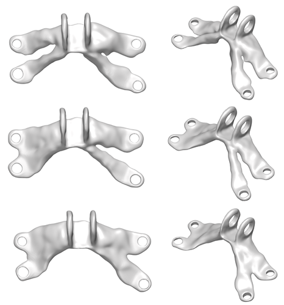

# Geometry-informed Neural Networks

### [Project Page](https://arturs-berzins.github.io/GINN/) | [arXiv](https://arxiv.org/abs/2402.14009)


This project accompanies the paper "Geometry-informed Neural Networks" (GINNs) and as an instance of GINNs "Generative Topology Optimization: Exploring Diverse Solutions in Structural Design" (also see [GenTO github](https://github.com/ml-jku/Generative-Topology-Optimization)).
GINNs allow to train shape generative models without data by satisfying design requirements given as constraints and objectives.
In particular, a diversity constraint makes these models generative.
GINNs not only learn to generate multiple diverse solutions, but can also learn an organized latent space as shown above.

More information on GenTO can be found below and on the [GenTO github page](https://github.com/ml-jku/Generative-Topology-Optimization).


## Updates to codebase

#### 2025/02: 
- Added support for GenTO.
- Refactor s.t. config object does not leave the ginn_trainer.py. This way classes and functions used by the ginn_trainer.py are more modular and reusable.
- For many-shape optimization, it is recommended to use surface.do_numerical_surface_points=True or do *_numerical versions, as they are usually faster. For a few-shape optimization, the flow-based surface points are faster.

## Organization

```
/
├── run.py                          # Entry point for the program
├── train/                          # Functionality for training
│   └── ginn_trainer.ipynb          # Handles the training loop of the network
├── configs/                        # Contains YML files to configure
├── GINN/                           # folder for GINN training
│   ├── data/                       # Dataloader for a setting of GINNs with data
│   ├── evaluation/                 # Code to compute metrics of generated 2D and 3D shapes
│   ├── ph/                         # Classes to manage the connectedness loss based on persistent homology
│   ├── plot/                       # Plotters for 2D and 3D
│   ├── problems/                   # Contains general geometric primitives
│   ├── simJEB/                     # Contains files to load the simjeb envelope and interface
│   ├── speed/                      # Contains classes useful for multiprocessing or measuring time
├── models/                         # Model definitions for different architectures
├── util/                           # Utilities used throughout the project
```

## Get started

Install the dependencies, ideally in a fresh environment
```pip install -r requirements.txt```
or 
```conda env create -f requirements.yml```.

GenTO has more dependencies, e.g. FenicsX or OpenMPI. 
They can be tricker too install, that's why we dynamically import them only if they are needed for topology optimization (i.e. to compute compliance gradients). 
These can be installed via conda
```conda env create -f environment.yml```.


### Jet engine bracket

The problem described in Section 4.3. The problem specification draws inspiration from an engineering design competition hosted by General Electric and GrabCAD ([paper](https://arxiv.org/abs/2105.03534v1), [website](https://simjeb.github.io/)). The challenge was to design the lightest possible lifting bracket for a jet engine subject to both physical and geometrical constraints. Here, we focus only on the geometric constraints: the shape must fit in a provided design space and attach to six cylindrical interfaces. In addition, we require connectedness as a trivial requirement for structural integrity and a smooth surface.


Start the training by specifying a config from the `configs` folder.

```python run.py gpu_list=0 yml=GINN/simjeb_wire_singleshape```


### Minimal surface

Plateau’s problem is to find the surface $S$ with the minimal area given a prescribed boundary $\Gamma$ (a closed curve in $X \in \mathbb{R}$).
A minimal surface is known to have zero mean-curvature $\kappa_H$ everywhere.

With [notebooks/min_surf.ipynb](notebooks/minimal_surface.ipynb) you can train a GINN to learn the minimal surface. It takes a few seconds to converge. This code does not use the more advanced adaptive augmented Lagrangian method for constrained optimization.


## Citation

```
@article{berzins2024geometry,
  title={Geometry-informed neural networks},
  author={Berzins, Arturs and Radler, Andreas and Volkmann, Eric and Sanokowski, Sebastian and Hochreiter, Sepp and Brandstetter, Johannes},
  journal={arXiv preprint arXiv:2402.14009},
  year={2024}
}
```

## Generative Topology Optimization: Exploring Diverse Solutions in Structural Design

### [GenTO github overview](https://github.com/ml-jku/Generative-Topology-Optimization)

Generative Topology optimization (GenTO) as an instance of GINNs is added in this repo. 
It is reproducible by using the YAMLs in configs/GenTO.



